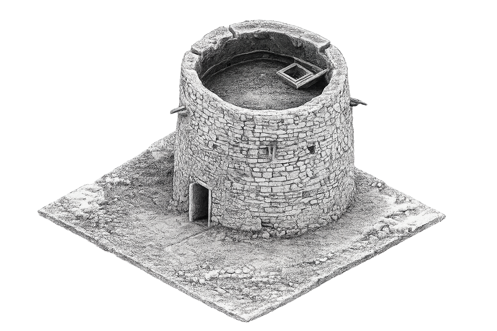

  

    

      <h1 style="font-size:44px; color:#E8E8E8; font-weight:300; margin-bottom:20px;">
        UNM Historic Preservation & Regionalism Program
        (Digital Lab)
      </h1>

      

        Cultural Scans for Interactive 3D Experiences (SITEs) is a digital
        historic preservation project that took place in New Mexico between
        2023 and 2025. Cultural SITEs explores how digital imaging technologies
        support the documentation, visualization, and preservation of historic
        sites throughout New Mexico.
      

        

      <h2 style="font-size:28px; color:#E8E8E8; font-weight:300; margin-bottom:0;">
        Symposium on
      </h2>

      <h1 style="font-size:72px; color:#FFFFFF; font-weight:300; margin-top:10px; margin-bottom:20px;">
        Cultural Sites
      </h1>

      

      

        Fort Selden 
        Lincoln 
        Mimbres 
        Salmon Ruins 
        Sevilleta Pueblo
      

    

    

      

    

  

